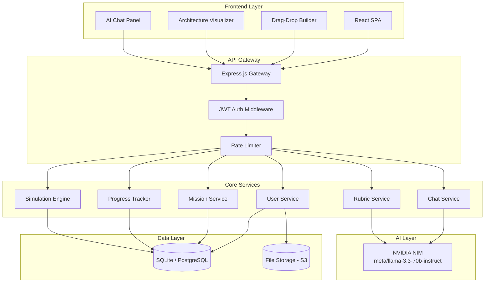
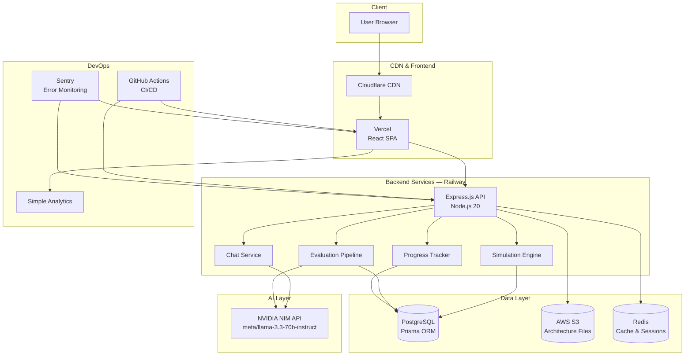
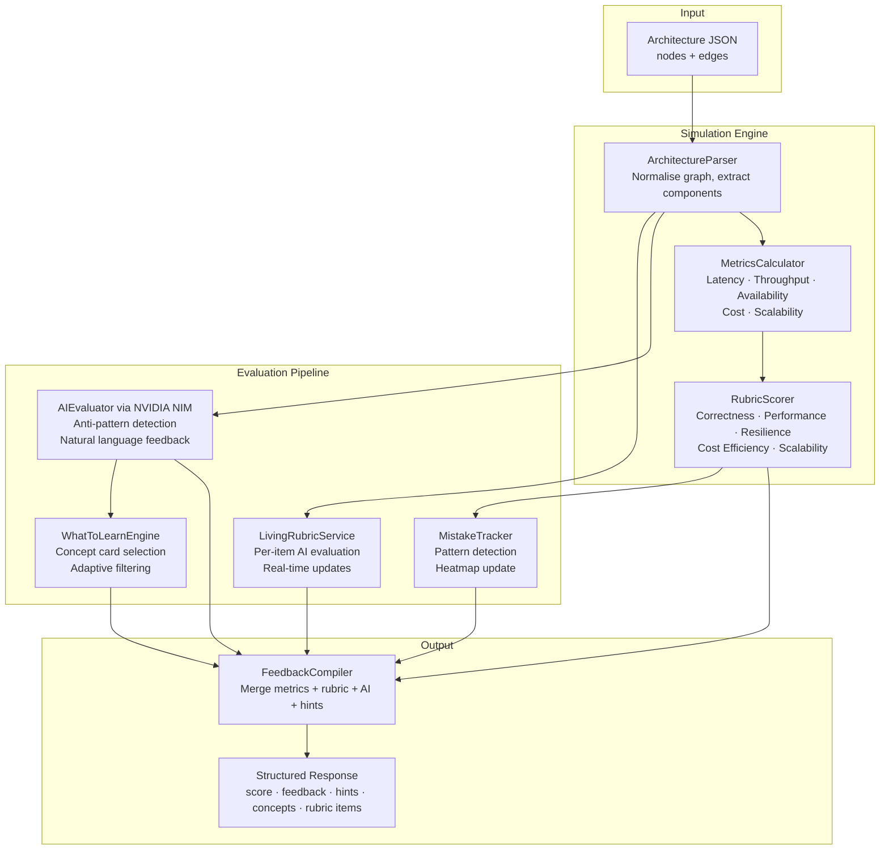
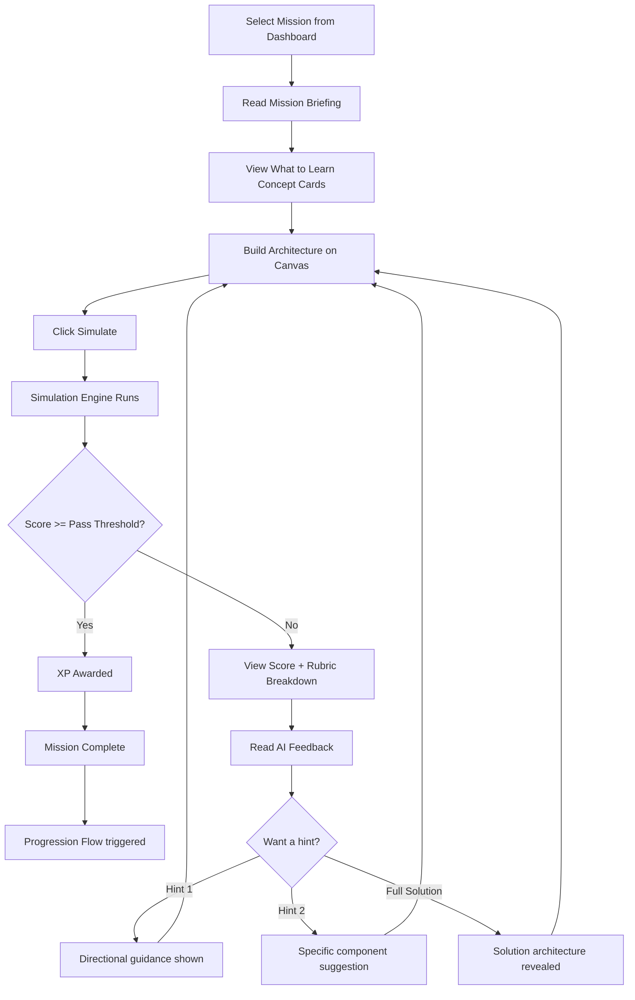
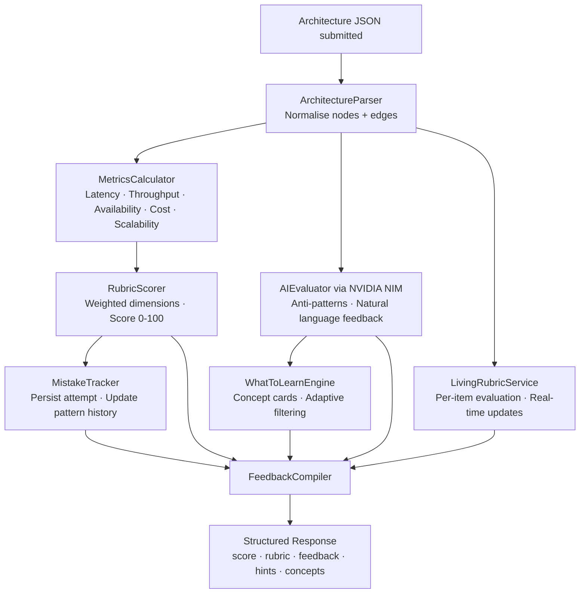
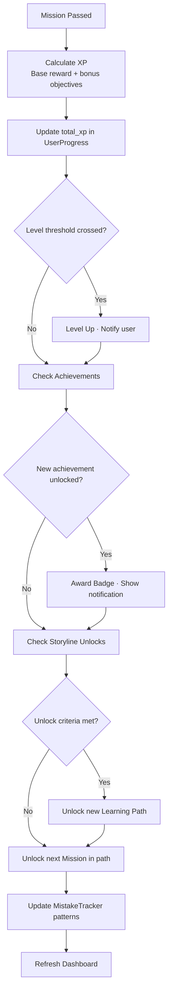
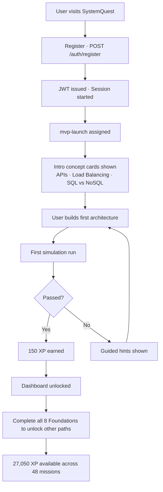

# 🎮 SystemQuest

> **Learn system design by building it.** Drag, connect, simulate, and level up through real-world engineering challenges — from startup MVPs to FAANG-scale architectures.


---

## What is SystemQuest?

SystemQuest is an interactive, gamified platform for learning system design. You solve engineering scenarios — "handle 10,000 concurrent users", "design WhatsApp's messaging backend", "build Stripe's payment pipeline" — by dragging architecture components onto a canvas and connecting them. A simulation engine scores your design in real time across latency, throughput, availability, cost, and scalability.

No passive reading. No multiple-choice quizzes. You build the system, the system tells you if it works.

---

## ✨ Features

### 🏗️ Drag-and-Drop Architecture Builder
- **Visual canvas** for placing and wiring system components
- **Component palette** includes: Client, Server, Load Balancer, Cache (Redis), SQL Database, NoSQL Database, CDN, Message Queue, API Gateway, Auth Service, File Storage
- **Drag-from-edge handles** for creating connections with auto-generated labels
- **Inline label editing** directly on connection lines
- **Multiple instances** of the same component type (e.g., 3 App Servers behind a Load Balancer)
- **Component count display** in the palette so you know what's on the canvas
- **Visual grouping** — cluster servers behind load balancers to represent horizontal scaling
- **Save and load** architecture state per mission attempt

### ⚙️ Simulation Engine
- **Real-time evaluation** of your architecture as you build
- **Five scored metrics:**
  | Metric | What It Measures |
  |---|---|
  | Latency | Response time in milliseconds |
  | Throughput | Requests per second |
  | Availability | Uptime percentage |
  | Cost | Estimated monthly infrastructure cost |
  | Scalability | Maximum concurrent users supported |
- **Honest feedback** — no misleading "looks solid" messages when critical metrics are failing
- **Throughput gap display** — "You need 7,650 more concurrent users to hit the target"
- **3-tier hint system** — Hint 1 (directional) → Hint 2 (specific) → Full solution reveal
- **Educational tooltips** on every component explaining its role and trade-offs

### 🤖 AI Chat Assistant
- **NVIDIA NIM-powered** tutor (`meta/llama-3.3-70b-instruct`) with design-aware context
- Understands the current mission, your architecture canvas state, and simulation results
- Answers follow-up questions, explains concepts, and suggests next steps
- **AI simulation narrative** — converts raw metrics into natural language explanations

### 📋 Living Rubrics
- **AI-generated topology quality evaluation** with per-item transparency
- Rubric items are evaluated individually and surfaced with pass/fail reasoning
- Updated dynamically as you modify the canvas — not just at submission time

### 🗺️ 48 Missions Across 6 Learning Paths

Missions are seeded across 3 sprints (`seed.ts`, `seed-sprint2.ts`, `seed-sprint3.ts`) plus `seed-lld.ts` which enriches 25 missions with full LLD content.

| Path | Missions | Level |
|---|---|---|
| 🏗️ Foundations | 8 | Beginner → Intermediate |
| ⚡ Async & Queues | 7 | Intermediate |
| 🚀 High-Read Systems | 9 | Intermediate → Advanced |
| 📡 Real-Time & Messaging | 8 | Intermediate → Advanced |
| 🔒 Consistency & Transactions | 6 | Advanced |
| 🌍 Scale & Streaming | 10 | Advanced |
| **Total** | **48** | **27,050 XP available** |

#### Full Mission List

**🏗️ Foundations (8)**

| Slug | Mission | Sprint | Diff | XP |
|---|---|---|---|---|
| `mvp-launch` | MVP Launch | 1 | ⭐ | 150 |
| `scaling-up` | Scaling Up | 1 | ⭐⭐ | 300 |
| `global-expansion` | Global Expansion | 1 | ⭐⭐⭐ | 500 |
| `design-chatgpt` | Build ChatGPT | 1 | ⭐⭐⭐⭐ | 300 |
| `secure-the-gates` | Secure the Gates | 2 | ⭐⭐ | 350 |
| `the-file-converter` | The File Converter | 2 | ⭐⭐ | 350 |
| `notification-engine` | The Notification Engine | 3 | ⭐⭐ | 250 |
| `rest-vs-graphql` | REST vs GraphQL Showdown | 3 | ⭐⭐ | 225 |

**⚡ Async & Queues (7)**

| Slug | Mission | Sprint | Diff | XP |
|---|---|---|---|---|
| `file-converter` | File Converter | 1 | ⭐⭐ | 400 |
| `code-judge` | Code Judge | 1 | ⭐⭐⭐⭐ | 450 |
| `design-kafka` | How Kafka Works | 1 | ⭐⭐⭐⭐ | 350 |
| `design-spotify` | How Spotify Works | 1 | ⭐⭐⭐⭐ | 375 |
| `how-reddit-works` | How Reddit Works | 2 | ⭐⭐⭐ | 500 |
| `event-driven-microservice` | Event-Driven Microservice | 3 | ⭐⭐⭐ | 400 |
| `concurrency-vs-parallelism` | Concurrency vs Parallelism | 3 | ⭐⭐⭐ | 400 |

**🚀 High-Read Systems (9)**

| Slug | Mission | Sprint | Diff | XP |
|---|---|---|---|---|
| `url-shortener` | URL Shortener | 1 | ⭐⭐⭐ | 500 |
| `search-engine` | Search Engine | 1 | ⭐⭐⭐⭐ | 650 |
| `design-google-search` | How Google Search Works | 1 | ⭐⭐⭐⭐⭐ | 450 |
| `how-amazon-s3-works` | How Amazon S3 Works | 2 | ⭐⭐⭐⭐⭐ | 800 |
| `bloom-filter-guardian` | Bloom Filter Guardian | 2 | ⭐⭐⭐ | 550 |
| `db-replication-deep-dive` | Database Replication Deep Dive | 2 | ⭐⭐⭐⭐ | 650 |
| `shard-or-die` | Shard or Die | 3 | ⭐⭐⭐⭐ | 425 |
| `youtube-deep-read` | How YouTube Works (Deep Read) | 3 | ⭐⭐⭐⭐⭐ | 500 |
| `two-phase-commit-practice` | Two-Phase Commit in Practice | 3 | ⭐⭐⭐⭐⭐ | 450 |

**📡 Real-Time & Messaging (8)**

| Slug | Mission | Sprint | Diff | XP |
|---|---|---|---|---|
| `live-scoreboard` | Live Scoreboard | 1 | ⭐⭐⭐ | 600 |
| `ride-hailing` | Ride Hailing | 1 | ⭐⭐⭐⭐⭐ | 700 |
| `design-whatsapp` | Design WhatsApp | 1 | ⭐⭐⭐⭐⭐ | 1,100 |
| `design-slack` | How Slack Works | 1 | ⭐⭐⭐⭐⭐ | 450 |
| `how-bluesky-works` | How Bluesky Works | 3 | ⭐⭐⭐⭐⭐ | 475 |
| `sports-leaderboard` | The Live Scoreboard (Remake) | 3 | ⭐⭐⭐ | 400 |
| `presence-at-scale` | Presence at Scale | 3 | ⭐⭐⭐ | 400 |
| `multiplayer-game-server` | Multiplayer Game Server | 3 | ⭐⭐⭐⭐ | 450 |

**🔒 Consistency & Transactions (6)**

| Slug | Mission | Sprint | Diff | XP |
|---|---|---|---|---|
| `booking-system` | Booking System | 1 | ⭐⭐⭐⭐ | 550 |
| `payment-processing` | Payment Processing | 1 | ⭐⭐⭐⭐⭐ | 800 |
| `design-uber-eta` | How Uber Computes ETA | 1 | ⭐⭐⭐⭐⭐ | 500 |
| `change-data-capture` | Change Data Capture | 2 | ⭐⭐⭐⭐ | 700 |
| `the-saga-pattern` | The Saga Pattern | 2 | ⭐⭐⭐⭐⭐ | 750 |
| `distributed-locks-deep-dive` | Distributed Locks Deep Dive | 3 | ⭐⭐⭐⭐⭐ | 500 |

**🌍 Scale & Streaming (10)**

| Slug | Mission | Sprint | Diff | XP |
|---|---|---|---|---|
| `social-feed` | Social Feed | 1 | ⭐⭐⭐⭐⭐ | 900 |
| `video-streaming` | Video Streaming | 1 | ⭐⭐⭐⭐⭐ | 1,000 |
| `design-instagram` | Design Instagram | 1 | ⭐⭐⭐⭐⭐ | 1,100 |
| `design-youtube` | Design YouTube | 1 | ⭐⭐⭐⭐⭐ | 1,200 |
| `design-twitter-timeline` | How Twitter Timeline Works | 1 | ⭐⭐⭐⭐⭐ | 550 |
| `service-mesh-microservices` | Service Mesh & Microservices | 2 | ⭐⭐⭐⭐⭐ | 900 |
| `cqrs-event-sourcing` | CQRS + Event Sourcing | 2 | ⭐⭐⭐⭐⭐ | 950 |
| `circuit-breaker` | Circuit Breaker Pattern | 3 | ⭐⭐⭐⭐ | 500 |
| `observability-at-scale` | Observability at Scale | 3 | ⭐⭐⭐⭐⭐ | 600 |
| `full-stack-observability-capstone` | Full-Stack Observability Capstone | 3 | ⭐⭐⭐⭐⭐ | 700 |

#### Seed File Breakdown

| File | Missions | Notes |
|---|---|---|
| `seed.ts` | 23 | Sprint 1 — core FAANG case studies |
| `seed-sprint2.ts` | 10 | Sprint 2 — deep dives & patterns |
| `seed-sprint3.ts` | 15 | Sprint 3 — advanced systems & capstone |
| `seed-lld.ts` | 0 new | Enriches 25 existing missions with LLD content |
| **Total** | **48** | |

#### FAANG & Real-World Systems Covered
MVP · URL Shortener · Zamzar · Codeforces · Google Search · CricBuzz · Airbnb · Twitter Feed · Uber · Netflix · Stripe · WhatsApp · Instagram · Slack · YouTube · Twitter Timeline · Uber ETA · ChatGPT · Apache Kafka · Spotify · Amazon S3 · Reddit · Bluesky

#### 40 System Design Concepts Taught
APIs · API Gateways · JWTs · Webhooks · REST vs GraphQL · Load Balancing · Proxy vs Reverse Proxy · Scalability · Availability · SPOF · CAP Theorem · SQL vs NoSQL · ACID Transactions · Database Indexes · Database Sharding · Consistent Hashing · CDC · Caching · Caching Strategies · Cache Eviction Policies · CDN · Rate Limiting · Message Queues · Bloom Filters · Idempotency · Concurrency vs Parallelism · Long Polling vs WebSockets · Stateful vs Stateless · Batch vs Stream Processing · Geohashing · Service Mesh · Circuit Breaker · Saga Pattern · Event Sourcing · CQRS · Distributed Locks · Consensus Algorithms · Replication · Two-Phase Commit · Observability

### 🏆 XP & Progression System
- **XP rewards** scale with difficulty: 150 XP (beginner) → 1,200 XP (advanced)
- **Bonus XP** for optional challenge objectives (+25–50 XP per bonus component)
- **Level progression** tied to cumulative XP
- **Skill tree** unlocks as you advance through paths
- **Achievement badges** for milestones and special completions
- **Storyline unlocks** — start as a "startup-founder", unlock new narratives as you progress

### 🎯 Gamification Layer
- XP progress bar with visual level indicator
- Achievement badge collection (9 achievements including "System Design Master")
- Global leaderboard with rankings
- Mission unlock gates (complete Foundations to access other paths)
- Per-mission bonus challenge objectives
- Visual skill tree showing mastery across all 6 paths

### 🔐 Authentication & User Management
- JWT authentication with refresh token rotation
- User registration and login
- Profile management with skill level tracking (beginner / intermediate / advanced)
- Performance-derived skill level auto-upgrade after milestone completions
- Full progress persistence across sessions

---

## 🛠️ Tech Stack

### Frontend
| Technology | Purpose |
|---|---|
| React 18 + TypeScript | UI framework |
| Vite | Build tool and dev server |
| Tailwind CSS | Utility-first styling |
| Zustand | Lightweight state management |
| @dnd-kit/core | Accessible drag-and-drop |
| Cytoscape.js | Architecture graph visualization |
| Headless UI | Accessible component primitives |

### Backend
| Technology | Purpose |
|---|---|
| Node.js 20 + TypeScript | Runtime and language |
| Express.js | HTTP framework |
| Prisma ORM | Database access and migrations |
| SQLite (dev) / PostgreSQL (prod) | Data persistence |
| JWT | Authentication tokens |
| Zod | Runtime type validation |
| Helmet + CORS | Security headers |
| NVIDIA NIM (`meta/llama-3.3-70b-instruct`) | AI chat assistant + rubric evaluation |

### Infrastructure
| Technology | Purpose |
|---|---|
| Docker + Docker Compose | Containerized local development |
| Nginx | Frontend reverse proxy |
| Vercel | Frontend deployment |
| Railway | Backend deployment |
| AWS S3 | User architecture file storage |
| Cloudflare CDN | Global asset delivery |
| Sentry | Error monitoring |
| Simple Analytics | Privacy-first usage analytics |
| GitHub Actions | CI/CD pipeline |

---

## 🏛️ System Architecture



---

## 🔍 High-Level Design (HLD)



---

## 🔧 Low-Level Design (LLD)



### Metric Calculation Rules

| Metric | Base | Modifiers |
|---|---|---|
| Latency | 50ms | +20ms per DB hop · ×0.7 with cache · +5ms per LB · −60% with CDN |
| Throughput | 200 req/s per server | ×server count behind LB · ×cache hit multiplier |
| Availability | 99.5% (single server) | +0.4% with LB+2 servers · +0.1% per DB replica |
| Scalability | 200 concurrent/server | +500/server behind LB · ×1.5 cache · ×2 CDN (read-heavy) |
| Cost | $50/server/month | Additive per component; CDN/S3 usage-based |

---

## 🔄 Design Flows

### Flow 1 — Mission Attempt



### Flow 2 — Evaluation Pipeline



### Flow 3 — Progression



### Flow 4 — Onboarding



---

## 🧠 Evaluation System

### Rubric-Based Scoring

| Dimension | What It Checks | Typical Weight |
|---|---|---|
| Correctness | Required components present and correctly connected | 30% |
| Performance | Latency, throughput, availability hit targets | 25% |
| Resilience | No SPOFs; redundancy where required | 20% |
| Cost Efficiency | Design within budget | 15% |
| Scalability | Reaches target concurrent users | 10% |

| Score | Grade | Outcome |
|---|---|---|
| 90–100 | Excellent | Full XP + bonus eligible |
| 75–89 | Good | Full XP awarded |
| 50–74 | Pass | XP awarded, suggestions shown |
| < 50 | Fail | No XP; hints unlocked |

### AI Evaluation Engine (NVIDIA NIM)

| Anti-Pattern | Example Feedback |
|---|---|
| Single Point of Failure | "Your database has no replica — this is a SPOF. Add a read replica." |
| Missing cache on read-heavy path | "You're hitting the database on every request. A cache would cut latency by ~60%." |
| No rate limiting | "Your API Gateway has no rate limiter. A bad actor could take down the service." |
| Synchronous-only chain | "A message queue between server and file processor would prevent timeouts." |
| Over-engineered for budget | "4 app servers for 1,000 users exceeds the $500/month budget by 3x." |

### Living Rubrics
- Per-item AI evaluation with pass/fail reasoning surfaced inline
- Updates dynamically as you modify the canvas
- Persisted in `MissionRubric` and retrievable via `GET /rubric/:slug`

### Progress-Based Mistake Tracking
- Full attempt snapshots stored (architecture, rubric scores, AI feedback, hints used)
- Pattern detection: *"You've missed a cache layer in 4 of your last 6 missions"*
- Mistake heatmap on Profile — colour-coded by failure frequency across all 40 concepts
- Adaptive hint system — proactively surfaces hints based on your recurring weak spots
- Weekly digest of top 3 recurring gaps with recommended missions

---

## 📁 Project Structure

```
systemquest/
├── docker-compose.yml
├── README.md
│
├── backend/
│   ├── Dockerfile
│   ├── package.json
│   ├── tsconfig.json
│   ├── prisma/
│   │   ├── schema.prisma
│   │   └── migrations/
│   └── src/
│       ├── index.ts
│       ├── middleware/
│       ├── prisma/
│       │   ├── seed.ts           # Sprint 1 — 23 missions
│       │   ├── seed-sprint2.ts   # Sprint 2 — 10 missions
│       │   ├── seed-sprint3.ts   # Sprint 3 — 15 missions
│       │   ├── seed-lld.ts       # LLD content enrichment — 25 missions updated
│       │   └── seed-concepts.ts  # Concept card data
│       ├── routes/
│       │   ├── auth.ts
│       │   ├── missions.ts
│       │   ├── simulation.ts
│       │   ├── progress.ts
│       │   ├── chat.ts
│       │   └── rubric.ts
│       └── services/
│           ├── simulationEngine.ts
│           ├── chatService.ts
│           ├── rubricService.ts
│           └── logger.ts
│
└── frontend/
    ├── Dockerfile
    ├── nginx.conf
    ├── package.json
    ├── vite.config.ts
    └── src/
        ├── components/
        │   ├── dashboard/  (Navbar, MissionCard)
        │   └── mission/    (Builder, ChatAssistant, SimulationResults, SolutionViewer, RubricCard)
        ├── pages/          (LandingPage, AuthPage, DashboardPage, MissionPage, ProgressPage)
        ├── data/           (types.ts, solutions.ts, api.ts, diagnostics.ts)
        └── stores/         (authStore, builderStore, chatStore)
```

---

## 🚀 Getting Started

### Prerequisites
- [Docker Desktop](https://www.docker.com/products/docker-desktop/) (recommended)
- Or: Node.js 20+, npm 9+

### Option 1: Docker Compose (Recommended)

```bash
git clone https://github.com/nevilshah235/systemquest.git
cd systemquest
cp .env.example .env
docker compose up --build
```

| Service | URL |
|---|---|
| Frontend | http://localhost:3000 |
| Backend API | http://localhost:4000 |

### Option 2: Manual Local Development

```bash
# Backend
cd backend && npm install && cp .env.example .env
npx prisma db push
npx prisma db seed                          # Sprint 1 — 23 missions
npx ts-node src/prisma/seed-sprint2.ts      # Sprint 2 — 10 missions
npx ts-node src/prisma/seed-sprint3.ts      # Sprint 3 — 15 missions
npx ts-node src/prisma/seed-lld.ts          # LLD enrichment
npm run dev

# Frontend (new terminal)
cd frontend && npm install && npm run dev
```

---

## 🔧 Environment Variables

```env
# backend/.env
DATABASE_URL="file:./dev.db"
JWT_SECRET="your-secret-key"
JWT_REFRESH_SECRET="your-refresh-secret"
JWT_EXPIRES_IN="15m"
JWT_REFRESH_EXPIRES_IN="7d"
PORT=4000
NODE_ENV=development
CORS_ORIGIN=http://localhost:3000
NVIDIA_API_KEY=""        # optional — enables AI chat + living rubrics
AWS_ACCESS_KEY_ID=""     # production only
AWS_SECRET_ACCESS_KEY="" # production only
AWS_S3_BUCKET=""
AWS_REGION="us-east-1"
SENTRY_DSN=""            # production only
```

---

## 📡 API Reference

Base URL: `/api` · Protected routes require `Authorization: Bearer <token>`

| Group | Method | Endpoint | Auth | Description |
|---|---|---|---|---|
| Auth | POST | `/auth/register` | No | Create account |
| Auth | POST | `/auth/login` | No | Login, receive tokens |
| Auth | POST | `/auth/refresh` | No | Refresh access token |
| Auth | POST | `/auth/logout` | Yes | Invalidate session |
| Missions | GET | `/missions` | Yes | List all missions with user progress |
| Missions | GET | `/missions/:slug` | Yes | Mission detail |
| Missions | POST | `/missions/:id/attempt` | Yes | Submit architecture |
| Simulation | POST | `/simulation/run` | Yes | Evaluate architecture |
| Progress | GET | `/progress` | Yes | XP, level, completions |
| Progress | GET | `/progress/leaderboard` | Yes | Global rankings |
| Chat | POST | `/chat/message` | Yes | AI tutor message |
| Chat | POST | `/chat/simulation-analysis` | Yes | AI simulation narrative |
| Rubric | POST | `/rubric/evaluate` | Yes | Living rubric evaluation |
| Rubric | GET | `/rubric/:slug` | Yes | Fetch approved rubric |

---

## 🗄️ Database Schema

```
Mission — 48 missions across 3 sprints
  slug (unique), title, difficulty (1-5), xpReward, order
  learningPath, skillLevel, estimatedTime
  objectives · requirements · components · feedbackData (all JSON)

MissionAttempt
  id, user_id → User, mission_id → Mission
  architecture (JSON), score, completed, feedback (JSON), attempt_number

User
  id, email (unique), username (unique), password_hash
  xp, level, skillLevel, derivedSkillLevel

Achievement (9 total)
  slug, title, description, icon, xp_bonus

MissionRubric
  mission_slug, rubric_items (JSON), evaluated_at, approved
```

---

## 🔬 Simulation Engine

| Metric | Base | Key Modifiers |
|---|---|---|
| Latency | 50ms | +20ms/DB hop · ×0.7 with cache · −60% with CDN |
| Throughput | 200 req/s | ×server count behind LB · ×cache hit multiplier |
| Availability | 99.5% | +0.4% with LB+2 servers · +0.1% per DB replica |
| Scalability | 200 users/server | +500/server behind LB · ×1.5 cache · ×2 CDN |
| Cost | $50/server/mo | Additive per component |

---

## 📦 NPM Scripts

| Location | Script | Description |
|---|---|---|
| backend | `npm run dev` | Hot-reload dev server |
| backend | `npm run build` | Compile TypeScript |
| backend | `npx prisma db seed` | Seed Sprint 1 (23 missions) |
| backend | `npx ts-node src/prisma/seed-sprint2.ts` | Seed Sprint 2 (+10 missions) |
| backend | `npx ts-node src/prisma/seed-sprint3.ts` | Seed Sprint 3 (+15 missions) |
| backend | `npx ts-node src/prisma/seed-lld.ts` | Enrich 25 missions with LLD content |
| backend | `npx prisma studio` | Visual DB browser |
| frontend | `npm run dev` | Vite dev server |
| frontend | `npm run build` | Production build |
| frontend | `npm run type-check` | TypeScript check |

---

## 📊 XP Summary

| Path | Missions | XP Available |
|---|---|---|
| 🏗️ Foundations | 8 | 2,425 |
| ⚡ Async & Queues | 7 | 2,875 |
| 🚀 High-Read Systems | 9 | 4,975 |
| 📡 Real-Time & Messaging | 8 | 4,575 |
| 🔒 Consistency & Transactions | 6 | 3,800 |
| 🌍 Scale & Streaming | 10 | 8,400 |
| **Total** | **48** | **27,050 XP** |

---

## 🌿 Branch

| Branch | Purpose |
|---|---|
| `main` | Stable production-ready code |

---

## 🤝 Contributing

### Adding a New Mission

1. Add the mission to the appropriate sprint seed file in `backend/src/prisma/`
2. Set `slug`, `title`, `learningPath`, `skillLevel`, `difficulty` (1–5), `xpReward`, `order`, `objectives`, `requirements`, `components`, and `feedbackData`
3. Run `npx ts-node src/prisma/seed-<sprint>.ts` locally
4. Update the mission table in this README

---

## 📄 License

MIT

---

*Built for engineers who learn by doing.*
