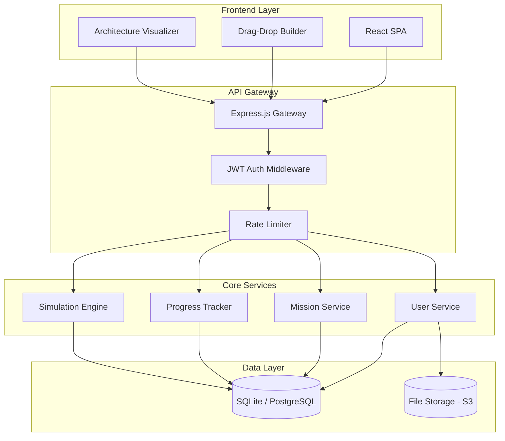
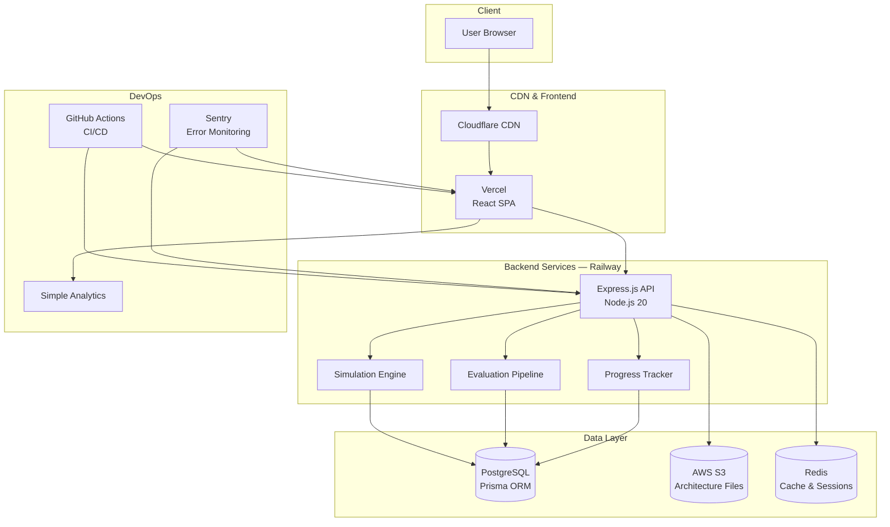
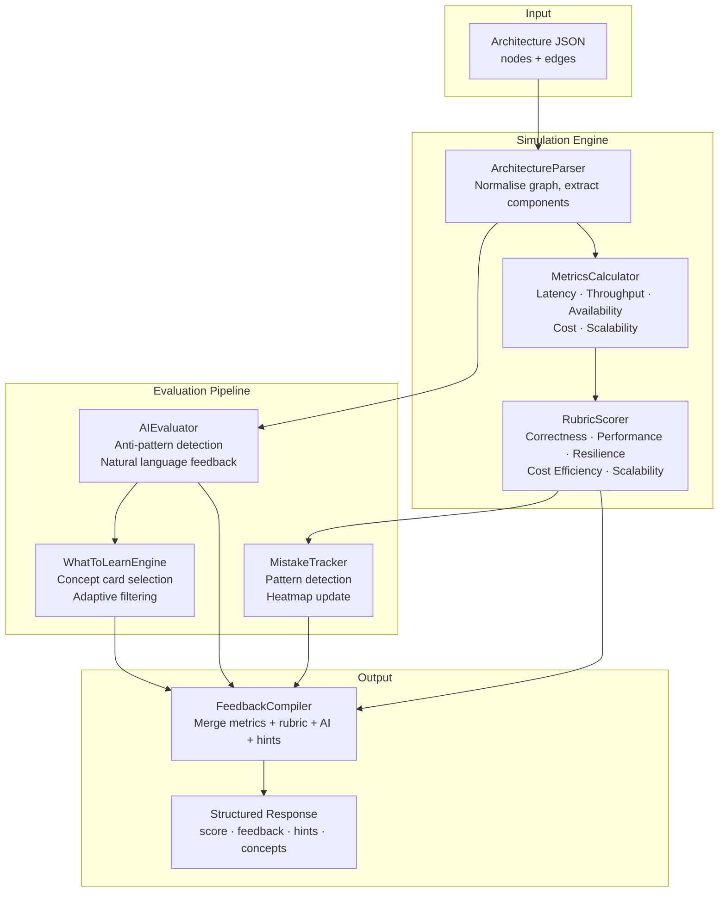
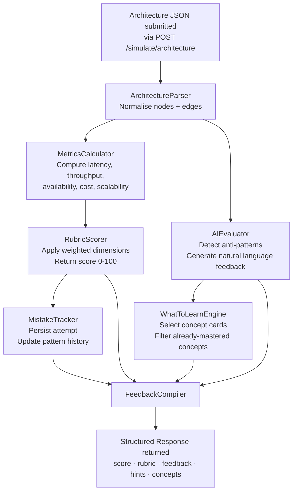
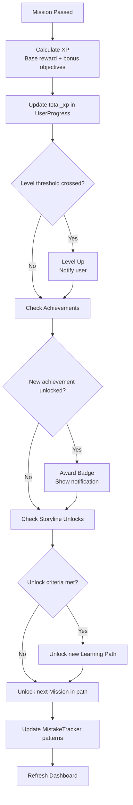
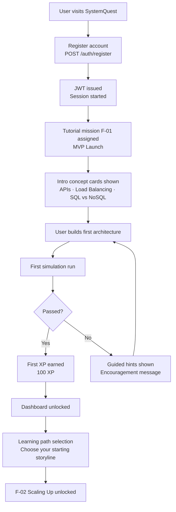

# 🎮 SystemQuest

> **Learn system design by building it.** Drag, connect, simulate, and level up through 50 real-world engineering challenges — from startup MVPs to FAANG-scale architectures.


---

## What is SystemQuest?

SystemQuest is an interactive, gamified platform for learning system design. You solve engineering scenarios — "handle 10,000 concurrent users", "design WhatsApp's messaging backend", "build Stripe's payment pipeline" — by dragging architecture components onto a canvas and connecting them. A simulation engine scores your design in real time across latency, throughput, availability, cost, and scalability.

No passive reading. No multiple-choice quizzes. You build the system, the system tells you if it works.

---

## ✨ Features

### 🏗️ Drag-and-Drop Architecture Builder
- **Visual canvas** for placing and wiring system components
- **Component palette** includes: Client, Server, Load Balancer, Cache (Redis), SQL Database, NoSQL Database, CDN, Message Queue, API Gateway, Auth Service, File Storage
- **Drag-from-edge handles** for creating connections with auto-generated labels
- **Inline label editing** directly on connection lines
- **Multiple instances** of the same component type (e.g., 3 App Servers behind a Load Balancer)
- **Component count display** in the palette so you know what's on the canvas
- **Visual grouping** — cluster servers behind load balancers to represent horizontal scaling
- **Save and load** architecture state per mission attempt

### ⚙️ Simulation Engine
- **Real-time evaluation** of your architecture as you build
- **Five scored metrics:**
  | Metric | What It Measures |
  |---|---|
  | Latency | Response time in milliseconds |
  | Throughput | Requests per second |
  | Availability | Uptime percentage |
  | Cost | Estimated monthly infrastructure cost |
  | Scalability | Maximum concurrent users supported |
- **Honest feedback** — no misleading "looks solid" messages when critical metrics are failing
- **Throughput gap display** — "You need 7,650 more concurrent users to hit the target"
- **3-tier hint system** — Hint 1 (directional) → Hint 2 (specific) → Full solution reveal
- **Educational tooltips** on every component explaining its role and trade-offs

### 🗺️ 50 Missions Across 6 Learning Paths

| Path | Missions | Level | Status |
|---|---|---|---|
| 1. Foundations | 10 | Beginner | 3 built ✅ |
| 2. Async & Queues | 8 | Beginner–Intermediate | 2 built ✅ |
| 3. High-Read Systems | 8 | Intermediate | 2 built ✅ |
| 4. Real-Time & Messaging | 8 | Intermediate | 3 built ✅ |
| 5. Consistency & Transactions | 8 | Advanced | 3 built ✅ |
| 6. Scale & Streaming | 8 | Advanced | 4 built ✅ |
| **Total** | **50** | | **17+ built** |

**Total XP available across all missions: 19,550 XP**

#### Currently Built Missions
| ID | Mission | Path | XP |
|---|---|---|---|
| F-01 | MVP Launch | Foundations | 100 |
| F-02 | Scaling Up | Foundations | 150 |
| F-04 | The URL Shortener | Foundations | 200 |
| A-01 | The Queue Master | Async & Queues | 275 |
| A-02 | Email at Scale | Async & Queues | 300 |
| H-01 | The Read-Heavy API | High-Read Systems | 325 |
| H-02 | Cache Everything | High-Read Systems | 350 |
| R-01 | WebSockets 101 | Real-Time & Messaging | 350 |
| R-02 | Rate Limit the World | Real-Time & Messaging | 375 |
| R-03 | How WhatsApp Works | Real-Time & Messaging | 450 |
| C-01 | ACID or Bust | Consistency & Transactions | 425 |
| C-02 | CAP Theorem in Practice | Consistency & Transactions | 450 |
| C-03 | How Payment System Works | Consistency & Transactions | 500 |
| SC-01 | CDN at the Edge | Scale & Streaming | 475 |
| SC-02 | Shard the Planet | Scale & Streaming | 500 |
| SC-03 | Consistent Hashing Deep Dive | Scale & Streaming | 475 |
| SC-08 | Observability at Scale *(partial)* | Scale & Streaming | 600 |

#### FAANG Case Studies Covered
URL Shortener · Zamzar · ChatGPT · Apache Kafka · Spotify · Reddit · Google Search · Amazon S3 · YouTube · WhatsApp · Slack · Bluesky · Stripe · Uber ETA · Twitter Timeline · NYSE Stock Exchange · Netflix · Datadog

#### 40 System Design Concepts Taught
APIs · API Gateways · JWTs · Webhooks · REST vs GraphQL · Load Balancing · Proxy vs Reverse Proxy · Scalability · Availability · SPOF · CAP Theorem · SQL vs NoSQL · ACID Transactions · Database Indexes · Database Sharding · Consistent Hashing · CDC · Caching · Caching Strategies · Cache Eviction Policies · CDN · Rate Limiting · Message Queues · Bloom Filters · Idempotency · Concurrency vs Parallelism · Long Polling vs WebSockets · Stateful vs Stateless · Batch vs Stream Processing · Geohashing · Service Mesh · Circuit Breaker · Saga Pattern · Event Sourcing · CQRS · Distributed Locks · Consensus Algorithms · Replication · Two-Phase Commit · Observability

### 🏆 XP & Progression System
- **XP rewards** scale with difficulty: 100 XP (beginner) → 600 XP (advanced)
- **Bonus XP** for optional challenge objectives (e.g., +30 XP for adding MFA, +45 XP for semantic caching)
- **Level progression** tied to cumulative XP
- **Skill tree** unlocks as you advance through paths
- **Achievement badges** for milestones and special completions
- **Storyline unlocks** — start as a "startup-founder", unlock new narratives as you progress

### 🎯 Gamification Layer
- XP progress bar with visual level indicator
- Achievement badge collection
- Global leaderboard with rankings
- Mission unlock gates (complete prerequisites to advance)
- Per-mission bonus challenge objectives
- Visual skill tree showing mastery across all 6 paths

### 🔐 Authentication & User Management
- JWT authentication with refresh token rotation
- User registration and login
- Profile management
- Full progress persistence across sessions

---

## 🛠️ Tech Stack

### Frontend
| Technology | Purpose |
|---|---|
| React 18 + TypeScript | UI framework |
| Vite | Build tool and dev server |
| Tailwind CSS | Utility-first styling |
| Zustand | Lightweight state management |
| @dnd-kit/core | Accessible drag-and-drop |
| Cytoscape.js | Architecture graph visualization |
| Headless UI | Accessible component primitives |

### Backend
| Technology | Purpose |
|---|---|
| Node.js 20 + TypeScript | Runtime and language |
| Express.js | HTTP framework |
| Prisma ORM | Database access and migrations |
| SQLite (dev) / PostgreSQL (prod) | Data persistence |
| JWT | Authentication tokens |
| Zod | Runtime type validation |
| Helmet + CORS | Security headers |

### Infrastructure
| Technology | Purpose |
|---|---|
| Docker + Docker Compose | Containerized local development |
| Nginx | Frontend reverse proxy |
| Vercel | Frontend deployment |
| Railway | Backend deployment |
| AWS S3 | User architecture file storage |
| Cloudflare CDN | Global asset delivery |
| Sentry | Error monitoring |
| Simple Analytics | Privacy-first usage analytics |
| GitHub Actions | CI/CD pipeline |

---

## 🏛️ System Architecture

The core architecture separates the React SPA (served via Vercel + Cloudflare) from the Express.js API (hosted on Railway), with Prisma managing all database access and AWS S3 handling architecture file storage.



---

## 🔍 High-Level Design (HLD)

The HLD shows the full production deployment topology — how traffic flows from a user's browser through Cloudflare's CDN, into the Vercel-hosted frontend, across to the Railway-hosted API, and down into the data layer. GitHub Actions drives all deployments; Sentry captures errors across both frontend and backend.



---

## 🔧 Low-Level Design (LLD)

The LLD details the internal component structure of the Simulation Engine and Evaluation Pipeline — the two most complex subsystems. The `ArchitectureParser` normalises the raw canvas JSON into a typed graph; each downstream module operates on that graph independently before the `FeedbackCompiler` assembles the final response.



### Metric Calculation Rules

| Metric | Base | Modifiers |
|---|---|---|
| Latency | 50ms | +20ms per DB hop · ×0.7 with cache · +5ms per LB · −60% with CDN (static) |
| Throughput | 200 req/s per server | ×server count behind LB · ×cache hit multiplier |
| Availability | 99.5% (single server) | +0.4% with LB + 2 servers · +0.1% per DB replica |
| Scalability | 200 concurrent/server | +500 per additional server behind LB · ×1.5 with cache · ×2 with CDN (read-heavy) |
| Cost | $50/server/month | Additive per component type; CDN and S3 usage-based |

---

## 🔄 Design Flows

Key user journeys through the platform, from first login to mission completion.

### Flow 1 — Mission Attempt


### Flow 2 — Evaluation Pipeline



### Flow 3 — Progression



### Flow 4 — Onboarding



---

## 🧠 Evaluation System

SystemQuest evaluates every architecture submission across four layers: a deterministic rubric, a simulation-derived metrics check, an AI pattern analysis, and a longitudinal mistake tracker. Together they produce feedback that is specific, actionable, and personalised to each user's history.

### Rubric-Based Scoring

Each mission defines a `success_criteria` JSON object with five weighted dimensions. The final score is a weighted average across all dimensions, scored 0–100.

| Dimension | What It Checks | Typical Weight |
|---|---|---|
| Correctness | Required components present and correctly connected | 30% |
| Performance | Latency, throughput, and availability hit mission targets | 25% |
| Resilience | No single points of failure; redundancy where required | 20% |
| Cost Efficiency | Design stays within the mission's budget constraint | 15% |
| Scalability | Architecture can reach the target concurrent user count | 10% |

**Score thresholds:**

| Score | Grade | Outcome |
|---|---|---|
| 90–100 | Excellent | Full XP + bonus eligible |
| 75–89 | Good | Full XP awarded |
| 50–74 | Pass | XP awarded, improvement suggestions shown |
| < 50 | Fail | No XP; hints unlocked; retry encouraged |

**Example `success_criteria` JSON (Mission F-02 — Scaling Up):**

```json
{
  "rubric": {
    "correctness": {
      "weight": 0.30,
      "criteria": ["load_balancer_present", "multiple_app_servers", "database_connected"]
    },
    "performance": {
      "weight": 0.25,
      "criteria": ["throughput_above_10000", "latency_under_200ms"]
    },
    "resilience": {
      "weight": 0.20,
      "criteria": ["no_spof", "min_two_app_servers_behind_lb"]
    },
    "cost_efficiency": {
      "weight": 0.15,
      "criteria": ["monthly_cost_under_500"]
    },
    "scalability": {
      "weight": 0.10,
      "criteria": ["supports_10000_concurrent_users"]
    }
  }
}
```

---

### AI Evaluation Engine

After the rubric scorer runs, the AI Evaluator analyses the architecture graph for structural patterns and anti-patterns. It produces natural language feedback framed from the perspective of a senior engineer or FAANG interviewer.

**Anti-patterns detected:**

| Anti-Pattern | Example Feedback |
|---|---|
| Single Point of Failure | "Your load balancer routes all traffic to one database — this is a SPOF. Add a read replica." |
| Missing cache on read-heavy path | "You're hitting the database on every request. A cache layer here would cut latency by ~60%." |
| No rate limiting on public endpoint | "Your API Gateway has no rate limiter. A single bad actor could take down the service." |
| Synchronous-only chain | "Every step in your pipeline is synchronous. A message queue between the server and file processor would prevent timeouts on large uploads." |
| Over-engineered for budget | "You've added 4 app servers for a 1,000-user target. This exceeds the $500/month budget by 3×." |

**What the interviewer would say** — each piece of AI feedback includes a framing line that mirrors how a FAANG interviewer would raise the same concern, helping users build interview fluency alongside technical skill.

**Next concept suggestion** — the AI Evaluator maps each identified gap to one of the 40 system design concepts and surfaces it as a targeted learning recommendation: *"Based on this attempt, we recommend reviewing: Database Replication."*

---

### What to Learn

Every mission surfaces curated concept cards before and after the attempt, adapted to what the user already knows.

**Pre-mission cards** (shown in the Mission Briefing):
- 3–5 concept cards covering the key ideas needed to solve the mission
- Each card includes: definition, real-world analogy, when to use it, and the most common mistake

**Post-mission cards** (shown after evaluation):
- Reinforces concepts the user got wrong
- Skips concepts the user demonstrated mastery of
- Links directly to the next mission where the concept appears again

**Example concept card — Load Balancing:**

| Field | Content |
|---|---|
| **Definition** | Distributes incoming traffic across multiple servers to prevent any single server from becoming a bottleneck |
| **Real-world analogy** | A supermarket with 10 checkout lanes — a greeter directs customers to the shortest queue |
| **When to use it** | Any time you have more than one server handling the same type of request |
| **Common mistake** | Adding a load balancer but only placing one server behind it — the LB adds latency with no throughput benefit |

**Adaptive filtering:** if a user scores 90+ on the Performance dimension across 3 consecutive missions, performance-related concept cards are suppressed and replaced with their current weakest dimension.

---

### Progress-Based Mistake Tracking

Every mission attempt is stored in full — architecture snapshot, rubric scores per dimension, AI feedback, and hint usage. The Mistake Tracker analyses this history to surface patterns the user may not notice themselves.

**Pattern detection examples:**

> "You've missed adding a cache layer in 4 of your last 6 missions."

> "Rate limiting on public endpoints has been absent in every attempt this week."

> "You consistently place the load balancer after the database rather than before the app servers."

**Mistake heatmap (Profile page):**
- Visual grid of all 40 system design concepts
- Colour-coded by failure frequency: green (strong) → yellow (occasional gap) → red (recurring weakness)
- Click any concept to see which missions triggered that failure and what the correct approach was

**Adaptive hint system:**
- If a user has failed the Resilience dimension 3+ times, Hint 1 for their next mission proactively mentions redundancy — before they ask
- Hint tier thresholds adjust per user: users with a strong track record get fewer unsolicited hints

**Weekly mistake digest:**
- Delivered on the Dashboard each Monday
- Shows top 3 recurring gaps from the past 7 days
- Recommends 1–2 specific missions to address each gap

**Streak tracking:**
- Tracks consecutive missions completed without triggering a specific mistake type
- Example: "5-mission streak: no SPOF in any submission"
- Streaks are displayed on the Profile page and contribute to achievement badges

---

## 📁 Project Structure

```
systemquest/
├── docker-compose.yml          # Orchestrates frontend + backend containers
├── README.md
│
├── backend/
│   ├── Dockerfile
│   ├── package.json
│   ├── tsconfig.json
│   ├── prisma/
│   │   ├── schema.prisma       # Database models
│   │   └── migrations/         # Auto-generated migration history
│   └── src/
│       ├── index.ts            # Express app entry point
│       ├── middleware/         # Auth, rate limiting, error handling
│       ├── prisma/             # Prisma client singleton
│       └── routes/
│           ├── auth.ts         # Register, login, refresh, logout
│           ├── missions.ts     # Mission CRUD and attempt submission
│           ├── progress.ts     # XP, leaderboard, storyline unlocks
│           └── simulation.ts   # Architecture evaluation engine
│
└── frontend/
    ├── Dockerfile
    ├── index.html
    ├── nginx.conf              # Nginx config for production container
    ├── package.json
    ├── tailwind.config.js
    ├── vite.config.ts
    └── src/
        ├── components/
        │   ├── ui/             # Reusable UI primitives
        │   ├── builder/
        │   │   ├── ComponentPalette.tsx    # Draggable component library
        │   │   ├── ArchitectureCanvas.tsx  # Main drop target canvas
        │   │   ├── ComponentNode.tsx       # Individual placed component
        │   │   └── ConnectionLine.tsx      # Edges between components
        │   ├── mission/
        │   │   ├── MissionBriefing.tsx     # Scenario description
        │   │   ├── RequirementsList.tsx    # Target metrics display
        │   │   └── SuccessCriteria.tsx     # Pass/fail evaluation UI
        │   └── progress/
        │       ├── XPBar.tsx              # Level and XP display
        │       ├── SkillTree.tsx          # Path mastery visualization
        │       └── AchievementBadge.tsx   # Badge display component
        ├── pages/
        │   ├── Dashboard.tsx   # Mission selection and progress overview
        │   ├── Mission.tsx     # Active mission workspace
        │   ├── Profile.tsx     # User stats and achievements
        │   └── Leaderboard.tsx # Global rankings
        ├── hooks/
        │   ├── useAuth.ts
        │   ├── useMission.ts
        │   ├── useSimulation.ts
        │   └── useProgress.ts
        └── stores/
            ├── authStore.ts    # Auth state (Zustand)
            ├── missionStore.ts # Active mission state
            └── builderStore.ts # Canvas and component state
```

---

## 🚀 Getting Started

### Prerequisites
- [Docker Desktop](https://www.docker.com/products/docker-desktop/) (recommended)
- Or: Node.js 20+, npm 9+

---

### Option 1: Docker Compose (Recommended)

```bash
# Clone the repo
git clone https://github.com/nevilshah235/systemquest.git
cd systemquest

# Copy environment variables
cp .env.example .env

# Start both services
docker compose up --build
```

| Service | URL |
|---|---|
| Frontend | http://localhost:3000 |
| Backend API | http://localhost:4000 |

To stop:
```bash
docker compose down
```

---

### Option 2: Manual Local Development

#### Backend

```bash
cd backend

# Install dependencies
npm install

# Set up environment variables
cp .env.example .env

# Run database migrations
npx prisma migrate dev

# Seed initial mission data (optional)
npx prisma db seed

# Start development server
npm run dev
```

Backend runs at `http://localhost:4000`

#### Frontend

```bash
cd frontend

# Install dependencies
npm install

# Start development server
npm run dev
```

Frontend runs at `http://localhost:3000`

---

## 🔧 Environment Variables

Create a `.env` file in the `backend/` directory (or at root for Docker Compose):

```env
# Database
DATABASE_URL="file:./dev.db"          # SQLite for local dev
# DATABASE_URL="postgresql://..."     # PostgreSQL for production

# Authentication
JWT_SECRET="your-secret-key-here"
JWT_REFRESH_SECRET="your-refresh-secret-here"
JWT_EXPIRES_IN="15m"
JWT_REFRESH_EXPIRES_IN="7d"

# Server
PORT=4000
NODE_ENV=development

# Storage (production)
AWS_ACCESS_KEY_ID=""
AWS_SECRET_ACCESS_KEY=""
AWS_S3_BUCKET=""
AWS_REGION="us-east-1"

# Monitoring (production)
SENTRY_DSN=""
```

---

## 📡 API Reference

All endpoints are prefixed with `/api`. Protected routes require `Authorization: Bearer <token>`.

### Authentication

| Method | Endpoint | Auth | Description |
|---|---|---|---|
| POST | `/auth/register` | No | Create new account |
| POST | `/auth/login` | No | Login and receive tokens |
| POST | `/auth/refresh` | No | Refresh access token |
| POST | `/auth/logout` | Yes | Invalidate refresh token |

### User

| Method | Endpoint | Auth | Description |
|---|---|---|---|
| GET | `/user/profile` | Yes | Get user profile |
| PUT | `/user/profile` | Yes | Update profile |
| GET | `/user/progress` | Yes | Get XP, level, completed missions |
| GET | `/user/achievements` | Yes | Get earned badges |

### Missions

| Method | Endpoint | Auth | Description |
|---|---|---|---|
| GET | `/missions/available` | Yes | List unlocked missions for user |
| GET | `/missions/:id` | Yes | Get mission details and requirements |
| POST | `/missions/:id/attempt` | Yes | Submit architecture for evaluation |
| GET | `/missions/:id/attempts` | Yes | Get attempt history for a mission |
| PUT | `/missions/:id/attempts/:attemptId` | Yes | Update a saved attempt |

### Simulation

| Method | Endpoint | Auth | Description |
|---|---|---|---|
| POST | `/simulate/architecture` | Yes | Evaluate an architecture and return metrics |
| POST | `/simulate/validate` | Yes | Validate architecture against mission criteria |
| GET | `/simulate/results/:id` | Yes | Retrieve a previous simulation result |

### Progress

| Method | Endpoint | Auth | Description |
|---|---|---|---|
| POST | `/progress/complete-mission` | Yes | Mark mission complete, award XP |
| GET | `/progress/leaderboard` | Yes | Get global XP rankings |
| POST | `/progress/unlock-storyline` | Yes | Unlock a new learning path |

---

## 🗄️ Database Schema

Managed by Prisma. Run `npx prisma studio` to browse data visually.

**User** — account credentials and identity
```
id, email (unique), username (unique), password_hash, created_at, updated_at
```

**UserProgress** — XP, level, and mission completion state per user
```
id, user_id → User, current_level, total_xp, unlocked_storylines[], completed_missions[], created_at, updated_at
```

**Mission** — scenario, requirements, and rewards (seeded data)
```
id (e.g. "F-01"), storyline, level, title, description, requirements (JSON), success_criteria (JSON), xp_reward, unlocks[]
```

**MissionAttempt** — each architecture submission per user per mission
```
id, user_id → User, mission_id → Mission, architecture (JSON snapshot), score, completed, feedback (JSON), attempt_number, created_at
```

**UserSkills** — concept mastery tracking per user
```
id, user_id → User, skill_name, level, xp, unlocked_at
```

---

## 🔬 Simulation Engine

```typescript
interface ArchitectureMetrics {
  latency: number;      // Response time in ms
  throughput: number;   // Requests per second
  availability: number; // Uptime percentage (0–100)
  cost: number;         // Estimated monthly cost in USD
  scalability: number;  // Max concurrent users
}
```

| Metric | Base | Key Modifiers |
|---|---|---|
| Latency | 50ms | +20ms/DB hop · ×0.7 with cache · −60% with CDN |
| Throughput | 200 req/s | ×server count behind LB · ×cache hit multiplier |
| Availability | 99.5% | +0.4% with LB+2 servers · +0.1% per DB replica |
| Scalability | 200 concurrent/server | +500/server behind LB · ×1.5 cache · ×2 CDN |
| Cost | $50/server/month | Additive per component; CDN/S3 usage-based |

---

## 📦 NPM Scripts

### Backend (`/backend`)

| Script | Description |
|---|---|
| `npm run dev` | Start dev server with hot reload |
| `npm run build` | Compile TypeScript to `/dist` |
| `npm run start` | Run compiled production build |
| `npx prisma migrate dev` | Run pending migrations |
| `npx prisma studio` | Open Prisma visual DB browser |
| `npx prisma db seed` | Seed mission data |
| `npx prisma generate` | Regenerate Prisma client |

### Frontend (`/frontend`)

| Script | Description |
|---|---|
| `npm run dev` | Start Vite dev server |
| `npm run build` | Production build to `/dist` |
| `npm run preview` | Preview production build locally |
| `npm run type-check` | Run TypeScript compiler check |

---

## 🌿 Branches

| Branch | Purpose |
|---|---|
| `main` | Stable production-ready code |
| `feature/systemquest-mvp` | Active MVP development |
| `docs/readme-update` | Documentation updates (current) |

---

## 🤝 Contributing

1. **Fork** the repository
2. **Branch** from `feature/systemquest-mvp`:
   ```bash
   git checkout -b feature/your-feature-name
   ```
3. **Make your changes** with clear, focused commits
4. **Test locally** using Docker Compose or manual setup
5. **Open a PR** targeting `feature/systemquest-mvp`

### Adding a New Mission

1. Add the mission definition to `backend/prisma/seed.ts`
2. Define `requirements` and `success_criteria` as JSON matching the simulation engine's schema
3. Add any new component types to `frontend/src/components/builder/ComponentPalette.tsx`
4. Update the mission roadmap table in this README

---

## 📊 XP Economy

| Path | Total XP Available |
|---|---|
| Foundations | 2,025 |
| Async & Queues | 2,725 |
| High-Read Systems | 3,275 |
| Real-Time & Messaging | 3,350 |
| Consistency & Transactions | 3,950 |
| Scale & Streaming | 4,225 |
| **Grand Total** | **19,550 XP** |

---

## 📄 License

MIT — see [LICENSE](./LICENSE) for details.

---

*Built for engineers who learn by doing.*
